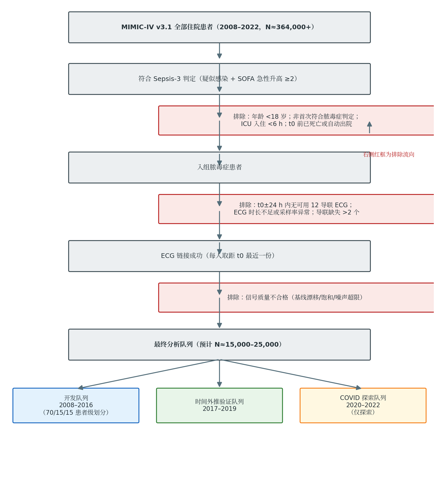
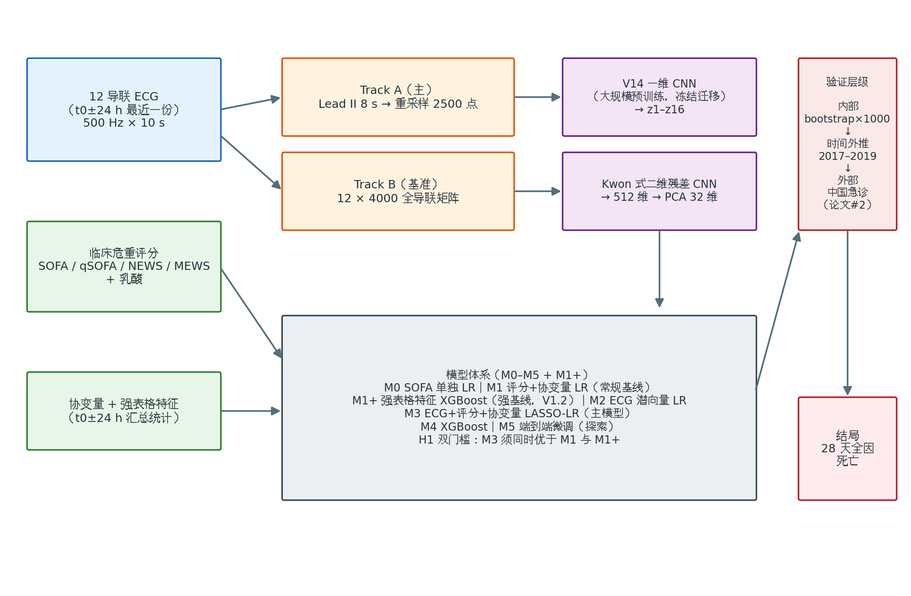

# 12 导联 ECG 深度学习特征联合临床危重评分预测脓毒症患者 28 天死亡风险

## 统计分析计划（Statistical Analysis Plan, SAP）

| 项目 | 内容 |
|---|---|
| 版本号 | **V1.2** |
| 发布日期 | 2026-08-27 |
| 研究类型 | 预测模型开发与验证研究（TRIPOD+AI 类型 2b） |
| 开发数据来源 | MIMIC-IV v3.1 + MIMIC-IV-ECG v1.0 |
| 外部验证来源 | 中国急诊前瞻性队列（论文 #2，另行立项） |
| 主要结局 | 28 天全因死亡 |
| 注册信息 | ChiCTR 注册号：____（待回填）；不进行 OSF 预注册（见 1.3 节） |

**签署栏**

| 角色 | 姓名 | 签名 | 日期 |
|---|---|---|---|
| 主要研究者（PI） | | | |
| 统计负责人 | | | |
| 临床负责人 | | | |

---

## 目录

1. 文件信息与管理
2. 研究概述
3. 数据来源与研究人群
4. 结局定义
5. 预测变量
6. 样本量论证
7. 数据集划分
8. 模型体系与训练方案
9. 统计分析计划
10. 缺失数据处理
11. 可解释性分析
12. 报告规范
13. 偏离管理
14. 时间表
15. 参考文献
16. 附录 A：变量操作定义表
17. 附录 B：仓库结构与可重复性清单

---

# 一、文件信息与管理

## 1.1 文档基本信息

| 项目 | 内容 |
|---|---|
| 文档名称 | 脓毒症 ECG 深度学习联合危重评分预后模型——统计分析计划 |
| 版本 | V1.2 |
| 生效日期 | 2026-08-27 |
| 适用范围 | 论文 #1（MIMIC-IV 开发 + 内部/时间外推验证）；论文 #2（外部验证）将另行制定 SAP 增补版 |
| 配套文件 | 研究方案、数据字典、代码仓库（见附录 B） |

## 1.2 版本控制

| 版本 | 日期 | 修订内容 | 修订人 |
|---|---|---|---|
| V1.0 | 2026-08-23 | 初版签发 | — |
| V1.1 | 2026-08-27 | ① 参考文献新增 [17]（MINERS 研究），2.1 节增加区隔表述；② 9.7 节新增预设探索性分析 E1（ECG 潜向量与 SOFA 器官分项相关性） | — |
| V1.2 | 2026-08-27 | 结合本团队前序动态预测研究 [18] 的阴性发现进行方法学补强：① 第八章新增强表格基线 M1+，H1 改为双门槛检验（M3 vs M1 且 M3 vs M1+）；② 9.7 节新增预设 ECG 可得性对照分析 A1；③ E1 叙事改写为"器官维度谱刻画"；④ 第六章新增 ΔAUC 检验功效预设核算；⑤ 参考文献新增 [18] 并在 2.1 节作为前序工作区隔引用 | — |

**版本升级规则**：本 SAP 在数据锁定（特征矩阵生成并记录 SHA-256 哈希）之前的任何实质性修改，须升级版本号、签署并记录修订原因；数据锁定后仅允许以"偏离"形式记录（见第十三章）。

## 1.3 预注册与公开策略

本研究**不进行 OSF 预注册**，采用以下五项等效措施保障分析计划的透明性与可追溯性：

1. **签署日期化 SAP**：本文档经 PI 与统计负责人签署、注明日期后生效，任何修改执行版本升级规则（1.2 节）。
2. **GitHub commit 时间戳**：SAP 文件与分析代码同步纳入私有 Git 仓库管理，每次版本升级对应一次带时间戳的 commit，作为修改时点凭据。
3. **ChiCTR 注册**：研究整体在中国临床试验注册中心（ChiCTR）完成注册，注册号回填至本文档封面。
4. **投稿时 SAP 作为补充材料**：论文投稿时，将签署版 SAP（含全部版本历史）作为补充材料提交。
5. **偏离日志**：所有与 SAP 不一致的分析决策记录于偏离日志（第十三章），随论文一并报告。

**数据锁定**：以开发队列特征矩阵文件（`features_dev.parquet`）生成时刻为准，记录文件 SHA-256 哈希值于 Git 仓库 `DATA_LOCK.md`。锁定前任何模型不得接触测试集结局标签。

---

# 二、研究概述

## 2.1 立论依据

脓毒症是急诊与重症医学领域死亡风险最高的综合征之一。现有临床危重评分（SOFA、qSOFA、NEWS、MEWS）对 28 天死亡的区分度有限（AUC 多在 0.65–0.75）。静息 12 导联心电图（ECG）在急诊常规获得、成本极低，深度学习可从 ECG 中提取人眼不可见的病理生理信号。既往研究提示 ECG 深度学习特征对脓毒症死亡具有独立预测价值 [1]，心率变异性等传统心电指标联合 SOFA/APACHE II 可提升急诊 ICU 脓毒症 28 天死亡预测 [2]，但**将深度学习 ECG 表征作为增量预测因子与标准危重评分联合建模**的研究尚属空白，本研究属于方法学升级层面的创新。

近期 Wang 等发表的 MINERS 研究 [17] 通过无监督多模态整合（EHR 纵向变量、胸片、ECG 频域特征、文本）识别出 4 个可复现的脓毒症亚型，并发现高死亡亚型（B、D 型）中 ECG 与胸片特征贡献最大。该研究与本研究在科学问题（亚型发现 vs. 个体化预后预测）、方法范式（无监督聚类 vs. 监督式增量价值建模）与终点（亚型×治疗反应 vs. 28 天死亡判别/校准/临床效用）上均不同，不构成重复；相反，其"高死亡亚型富集 ECG 特征"的发现为本研究"ECG 表征与危重评分互补"的核心假设提供了表型学层面的间接证据，并提示 ECG 潜向量可能主要编码循环功能维度（见 9.7 节探索性分析 E1）。

本团队的前序研究 [18] 在 MIMIC-IV 与 eICU-CRD 中评估了 12 导联 ECG 对**动态 24 小时死亡预测**（landmark 设计）的增量价值，结果为阴性：配对比较 ΔiAUROC +0.0063（95%CI −0.0023 至 +0.0183），且增量大部分由 ECG 可得性本身携带。该研究同时明确了三个外推边界：① 主要比较功效仅足以检测 Δ≈0.05，小效应无法排除；② 结论不扩展至大规模预训练 ECG 表征（该研究编码器为从零训练的 1D ResNet-18）；③ 动态短期预测中逐时临床数据流已近乎穷尽短期预后信息，与**静态 t0 时刻的中期（28 天）预后**属不同信息场景。本研究正是针对上述边界设计：结局为 28 天死亡、采用大规模预训练编码器（Track A），并将该研究确立的强表格基线（M1+，8.1 节）与 ECG 可得性对照（9.7 节 A1）采纳为方法学标准。两项研究构成递进的研究路线而非重复。

**目标期刊**：npj Digital Medicine（首选）与 Critical Care（备选）。

## 2.2 研究目的

- **主要目的**：在标准危重评分基础上，评估深度学习 ECG 表征对脓毒症患者 28 天全因死亡预测的增量价值。
- **次要目的**：比较不同特征提取策略（Track A / Track B）与不同建模范式（逻辑回归 / 梯度提升 / 端到端微调）的性能差异；评估模型的时间外推稳健性与临床效用。

## 2.3 研究假设

| 编号 | 假设内容 |
|---|---|
| H1 | **双门槛（V1.2 修订）**：主模型 M3（ECG 潜向量 + 评分 + 协变量）的 AUC 同时满足——① 显著优于 M1（评分 + 乳酸 + 协变量，临床常规基线）；② 显著优于 M1+（强表格基线，t0±24 h 生命体征与检验汇总特征 + 协变量）。两道比较均 DeLong 检验 P<0.05 且 ΔAUC≥0.02 方可确认增量价值；仅过门槛①而未过门槛②者，结论表述为"ECG 增量可能部分来自对既有临床信息的再编码" |
| H2 | M3 较 M1 与 M1+ 具有显著的重分类改善（类别 NRI 与连续 NRI>0，IDI>0，分别报告） |
| H3 | M3 在 2017–2019 时间外推队列中 AUC 下降幅度 <0.05 |
| H4 | M3 在决策曲线阈值概率 5%–50% 范围内具有正的净获益 |

## 2.4 研究设计

- 回顾性队列研究；预测模型开发与验证研究，TRIPOD+AI 类型 2b（开发 + 同研究内时间/空间外推验证）。
- 开发队列：MIMIC-IV（2008–2016）；时间外推验证：MIMIC-IV（2017–2019）；2020–2022（COVID 时段）仅作探索。
- 外部验证（中国急诊队列）为论文 #2 内容，不在本 SAP 范围内。

---

# 三、数据来源与研究人群

## 3.1 数据库

| 数据库 | 版本 | 用途 |
|---|---|---|
| MIMIC-IV | v3.1 | 临床事件、诊断、检验、生命体征、结局 |
| MIMIC-IV-ECG | v1.0 | 12 导联静息 ECG 波形（500 Hz，10 s） |

**本地数据存储（2026-08-27 登记）**：MIMIC-IV v3.1 完整数据集（患者数据、官方衍生表与 MIMIC-IV-ECG 波形）存储于本地路径 `E:\clinical_research\MIMIC_IV_3.1`。该目录内已构建 DuckDB 数据库文件 `mimic_iv_3_1.duckdb`（约 53 GB），包含 `main` schema（hosp / icu / ed / note 模块原始表，共 50 张）与 `mimiciv_derived` schema（官方衍生表，共 94 张，含本研究队列判定所用的 `sepsis3` 派生表）；ECG 波形数据位于 `ecg/` 子目录（含 `record_list.csv` 波形索引与机器测量数据）。数据提取统一采用 Python + DuckDB（只读连接）完成，技术细节见目录内 `MIMIC_IV_3_1_DuckDB_Technical_Reference.md`。

## 3.2 Sepsis-3 判定规则

采用 mimic-code 官方 sepsis3 派生表口径：

1. **疑似感染**：先培养后 72 h 内使用抗生素，或先使用抗生素后 24 h 内留取培养；两者较早时刻记为 t0（疑似感染时刻）。
2. **器官功能障碍**：t0 前后 24 h 内 SOFA 评分急性升高 ≥2 分。

## 3.3 纳入与排除标准

**纳入**：符合 Sepsis-3 判定的住院患者。

**排除**：

- 年龄 <18 岁；
- 非首次符合脓毒症判定（同一患者多次脓毒症发作仅取首次）；
- ICU 入住 <6 h；
- t0 前已死亡或自动出院；
- t0±24 h 内无可用 12 导联 ECG；
- ECG 时长不足 8 s、采样率异常或导联缺失 >2 个；
- 信号质量不合格（基线漂移 / 电极饱和 / 高频噪声超限，阈值见代码 `qc_config.yaml`）。

## 3.4 ECG 链接与质控

- **链接窗口**：[t0−24 h, t0+24 h]，取距 t0 最近的一份 ECG，**每人一份**。
- **质控**：自动质控规则预设于代码仓库；质控失败者计入流程图排除项，不做人工挽救。

## 3.5 队列流程



各级样本量在数据提取后回填至流程图及表 3-1。

---

# 四、结局定义

| 结局 | 定义 | 类型 |
|---|---|---|
| **主要结局** | 28 天全因死亡（自 t0 起算；出院患者经 MIMIC 院外死亡记录或随访窗口判定；存活至 28 天且失访者按出院日截尾——因主要结局为二分类，仅取 28 天内死亡 vs. 存活） | 二分类 |
| 次要结局 1 | 院内全因死亡 | 二分类 |
| 次要结局 2 | 90 天全因死亡 | 二分类 |
| 次要结局 3 | ICU 内死亡 | 二分类 |
| 次要结局 4 | 28 天内发生脓毒性休克（Sepsis-3 休克标准：血管活性药物维持 MAP≥65 mmHg 且乳酸 >2 mmol/L） | 二分类 |

主要分析针对主要结局；次要结局分析均为探索性，不做主要结论声明。

---

# 五、预测变量

## 5.1 ECG 深度学习特征（双轨）

| 轨道 | 输入 | 编码器 | 输出 | 角色 |
|---|---|---|---|---|
| **Track A（主）** | Lead II 8 s 片段，重采样至 2500 点 | V14 一维 CNN 编码器，**冻结迁移**（权重不在本队列重训） | 16 维潜向量 z1–z16 | 主要分析 |
| **Track B（基准）** | 12 导联 × 4000 点矩阵 | Kwon 式二维残差 CNN | 512 维 → PCA 降维至 32 维 | 基准比较 |

## 5.2 临床危重评分

- SOFA 总分（t0±24 h 内最差值）及六个器官分项（呼吸、凝血、肝脏、心血管、神经、肾脏）；
- qSOFA、NEWS、MEWS（急诊常规评分，作为对照评分）；
- 乳酸（t0±6 h 内首次值，缺失时取 t0±24 h 内首次值）。

## 5.3 协变量（上限 12 个）

年龄、性别、Charlson 合并症指数、感染部位（呼吸 / 腹腔 / 泌尿 / 血流 / 其他）、入院类型（急诊 / 择期）、入 ICU 前住院时长、机械通气（t0±24 h）、血管活性药物（t0±24 h）。协变量明细与操作定义见附录 A；如超上限，按临床重要性排序截断。

---

# 六、样本量论证

- **预期样本**：Sepsis-3 队列且 ECG 链接成功者预计 1.5 万–2.5 万例；28 天死亡事件数预计 2500–4500 例。
- **Riley/pmsampsize 核算**：以预期 C-statistic 0.78、候选参数 ≤50 个（M3 主模型有效自由度经 LASSO 收缩）、事件率 15% 估计，最小样本量约需 700–900 例，远低于实际可得样本，过拟合风险可控（预期 shrinkage ≥0.9）。
- 时间外推队列（2017–2019）事件数预计 ≥800，满足外部验证事件数 ≥100 的经验下限。
- **ΔAUC 检验功效预设核算（V1.2 新增）**：前序研究 [18] 的教训表明，总样本量大不等于配对比较功效充足（其主网格仅 152 个阳性 landmark，最小可检测 ΔiAUROC≈0.05，观测效应落入功效盲区）。本研究预设如下功效门槛：在测试集结局标签解盲**之前**，基于实际测试集样本量与事件数（预计测试集约 2250–3750 例、事件约 340–560 例），以模拟法（参照 [18] 的 prespecified simulation-based power analysis 框架，参数取基线 AUC 0.75–0.80、嵌套模型间相关系数 ρ≥0.85）核算 DeLong 检验对 ΔAUC=0.02 的功效；**仅当 80% 功效下最小可检测 ΔAUC ≤0.02 时方可解盲测试集执行 H1 检验**，否则 H1 降级为估计性分析（报告 ΔAUC 点估计与 95% CI，不做确认性声明）。核算脚本（`power_delong_sim.py`）与参数记录纳入数据锁定文件。

---

# 七、数据集划分

| 时段 | 角色 | 划分方式 |
|---|---|---|
| 2008–2016 | 开发队列 | 患者级随机划分：训练 70% / 调优 15% / 内部测试 15%，随机种子 **20260823**，划分在结局标签解盲前完成并冻结 |
| 2017–2019 | 时间外推验证队列 | 全量用于验证，不参与任何训练与调参 |
| 2020–2022 | COVID 探索队列 | 仅探索性分析，结果不纳入主要结论 |

同一患者的全部记录仅进入一个子集（患者级划分）。划分清单（`splits.csv`）与特征矩阵一并在数据锁定时记录 SHA-256 哈希。

---

# 八、模型体系与训练方案

## 8.1 模型一览

| 编号 | 输入 | 算法 | 角色 |
|---|---|---|---|
| M0 | SOFA 总分 | 逻辑回归 | 参照基线 |
| M1 | 评分（SOFA/qSOFA/NEWS/MEWS）+ 乳酸 + 协变量 | 逻辑回归 | 临床常规基线 |
| **M1+** | t0±24 h 生命体征与检验汇总统计特征（均值/最值/变异性，约 30–50 列）+ 乳酸 + 协变量 | XGBoost | **强表格基线（V1.2 新增）** |
| M2 | ECG 潜向量（Track A：z1–z16） | 逻辑回归 | ECG 单独贡献 |
| **M3** | ECG 潜向量 + 评分 + 乳酸 + 协变量 | **LASSO 逻辑回归** | **主模型** |
| M4 | 同 M3 全部特征 | XGBoost | 非线性基准 |
| M5 | 原始 ECG 波形端到端微调 + 临床分支 | 深度网络 | 探索性 |

## 8.2 训练细节

- **M1+（V1.2 新增）**：特征取自与 M1 相同的 t0±24 h 窗口内 17 通道核心生命体征/检验变量的汇总统计（各通道均值、最小、最大、标准差、末次值），加乳酸与协变量；XGBoost 超参与调参流程同 M4。设置目的：排除"ECG 增量仅是既有临床信息的再编码"这一竞争性解释（前序研究 [18] 显示该通路边界 iAUROC 可达 0.87 量级）。
- **M3**：LASSO 惩罚系数经 10 折交叉验证选取，报告 lambda.min 与 **lambda.1se** 两档，以 lambda.1se 为最终模型（优先简约性）；连续变量标准化后入模。
- **M4**：XGBoost 超参（max_depth∈{3,4,6}，eta∈{0.01,0.05,0.1}，subsample=0.8，colsample=0.8，min_child_weight∈{1,5}）在调优集网格搜索，早停轮次 50。
- **M5**：预训练编码器解冻末两层，学习率 1e-4（编码器）/1e-3（分类头），batch 64，早停 patience 10；仅作探索，结论以 M3 为准。
- **校准**：所有模型输出经 **Platt 校准**（调优集上拟合）；报告校准前后两套指标。
- **阈值**：约登指数确定的操作阈值在调优集上确定并**冻结**，随后在测试集与时间外推集上仅评估、不重新选择。



---

# 九、统计分析计划

## 9.1 分析总体原则

- 全部统计检验双侧，α=0.05；主要假设 H1 使用 DeLong 检验；多重比较采用 Holm 法校正（见 9.8）。
- 全部可复现分析固定随机种子 **20260823**。
- 分析软件：Python 3.12（scikit-learn / XGBoost / lifelines / torch）+ R（pROC、pmsampsize、rmda）；版本记录于 `environment.yml` / `renv.lock`。

## 9.2 描述性分析

- 基线表按 28 天生存/死亡分层：连续变量正态者以均数±标准差、偏态者以中位数（IQR）描述；分类变量以 n（%）描述。
- 组间比较：t 检验 / Mann-Whitney U / 卡方或 Fisher 精确检验；同时报告标准化差异（SMD），SMD>0.1 视为不均衡。
- 缺失模式表：各变量缺失率与缺失机制判断依据。
- **ECG 可链接性分层描述（V1.2 新增）**：队列流程各阶段同步报告 ECG 可链接 vs 不可链接患者的例数与基线对比（详见 9.7 节 A1a）。

## 9.3 主要分析（H1）

- 在内部测试集执行 H1 双门槛检验：M3 vs. M1 与 M3 vs. M1+，均用 DeLong 检验 + 2000 次 bootstrap 的 ΔAUC 95% CI；两道门槛的判定规则见 2.3 节 H1。
- 同步报告 M0、M1+、M2、M4、M5 的 AUC 及与 M3 的两两比较（Holm 校正）。
- 检验执行前提：第六章 ΔAUC 功效门槛已满足，否则按降级方案处理。

## 9.4 重分类与判别改善（H2）

- 连续 NRI、类别 NRI（风险分层切点预设为 <10% / 10–20% / >20%）、IDI，均附 bootstrap 95% CI。

## 9.5 校准与临床效用（H4）

- 校准截距、校准斜率；loess 平滑校准曲线（分箱 10 组叠加）；Brier 分数与 scaled Brier。
- 决策曲线分析（DCA）：阈值概率 5%–50%，比较 M3、M1、"全部干预"与"全不干预"策略的净获益。

## 9.6 内部验证与时间外推（H3）

- 开发队列内：bootstrap×1000 乐观校正，报告校正后 AUC。
- 时间外推验证（2017–2019）：报告 AUC、校准截距/斜率、Brier；若校准斜率 <0.8，预设**重校准预案**（仅更新截距或截距+斜率，报告更新前后指标，不重新拟合系数）。
- COVID 队列仅探索性报告 AUC 与校准曲线。

## 9.7 亚组分析与预设探索性分析

**亚组**（交互作用检验 + 森林图，均为探索性）：年龄（<65 / ≥65）、性别、脓毒性休克、SOFA 三分位、感染部位、房颤（ECG 节律）、心室率（<100 / ≥100）。

**预设分析 A1（V1.2 新增）：ECG 可得性对照。** 前序研究 [18] 证明 ECG 可得性本身携带预后信息（ECG 可得 landmark 的机械通气率 34.5% vs 28.1%、血管活性药使用率 30.3% vs 22.5%，且可得性指示变量吃掉了部署增量的约 60%）。本研究预设两步对照：

1. **描述性对照（A1a）**：比较 ECG 可链接者与不可链接者（t0±24 h 内无合格 ECG 而于 3.3 节排除者）的基线特征、SOFA、治疗强度与 28 天死亡率，以 SMD>0.1 判定系统性差异；结果入正文或补充材料。
2. **指示变量对照（A1b）**：在 M1+ 基础上仅加入二分类"ECG 可得性指示变量"构建对照模型，与 M3 比较。若 M3 的增量在控制可得性后消失，则主要结论须改写为"效应由 ECG 开单行为而非波形内容驱动"。

**预设探索性分析 E1（V1.1 新增，V1.2 修订叙事）**：ECG 潜向量的器官维度谱刻画。

- **内容**：计算 z1–z16 与 SOFA 六个器官分项评分及乳酸的 Spearman 相关系数矩阵，以热图呈现；对 |ρ|≥0.3 的关联进行偏相关分析（校正 SOFA 其余分项）。
- **目的与解释框架（V1.2 修订）**：刻画 ECG 潜向量的器官维度谱，而非预设其必然编码循环维度。前序研究 [18] 中 ECG 增量与 CV-SOFA≥3 的交互作用为阴性（−0.0059，95%CI −0.0333 至 +0.0192），提示 ECG 信息可能并不简单对应心血管 SOFA 维度；因此 E1 结果按如下框架解释——若 z 向量与心血管/肾脏分项相关，则与 MINERS 高死亡 B/D 亚型富集 ECG 特征的发现 [17] 呼应，支持循环维度叙事；若相关性弥散或指向其他维度，则作为刻画性结果如实报告，与 [18] 的阴性交互一并讨论。
- **性质与多重性**：探索性分析，不计入 H1–H4 检验序列；相关系数检验以 Benjamini-Hochberg 法控制 FDR（q=0.05），结果不作为主要结论。

## 9.8 多重性控制

- 主要检验序列（H1–H4）按 Holm 法校正；
- H1 双门槛（M3 vs M1、M3 vs M1+）为交集-并集式联合判定（两道均通过才算确认），单门槛 I 类错误不膨胀，无需额外校正；H1 与 H2–H4 之间仍按 Holm 法校正；
- A1 为预设对照分析，不做显著性声明，仅作效应归因；亚组与 E1 等探索性分析分别标注探索性质，E1 内部使用 BH-FDR。

## 9.9 敏感性分析

| 编号 | 内容 |
|---|---|
| S1 | ECG 链接窗口改为 [t0−48 h, t0]（纯预测窗） |
| S2 | 结局改为入院时刻起 28 天死亡（替代 t0 起算） |
| S3 | 排除 ICU 外符合脓毒症判定的患者（仅 ICU 亚队列） |
| S4 | 完整病例分析（不做插补）与 MICE 结果对比 |
| S5 | Track B 特征替换 Track A 重跑 M3 |
| S6 | 排除房颤/起搏心律 ECG |
| S7 | SOFA 改用 t0 时刻值（而非 t0±24 h 最差值） |
| S8 | 竞争风险框架（出院为竞争事件，Fine-Gray）下复核主要关联 |
| S9 | 不同校准方法（Platt vs. isotonic）对比 |
| S10 | 去除乳酸变量（评估其在增量价值中的贡献占比） |
| S11（V1.2 新增） | ECG 可得性指示变量纳入 M1/M1+ 的对照分析（即 9.7 节 A1b 的敏感性执行） |

## 9.10 分析流程时序

数据提取 → 队列判定 → ECG 链接与质控（同步执行 A1a 可链接性描述）→ 特征矩阵生成（**数据锁定，记录哈希**）→ 划分（训练/调优/测试）→ **ΔAUC 功效核算（满足门槛后方可解盲）**→ 模型训练与调参（仅训练+调优集）→ 测试集一次性评估 → 时间外推验证 → 敏感性/探索性分析。

---

# 十、缺失数据处理

- **机制判断**：结合缺失模式与临床知识判断 MCAR/MAR/MNAR；记录判断依据。
- **主要方案**：链式方程多重插补（MICE），**m=20**，插补模型纳入全部分析变量与结局 Nelson-Aalen 估计量；ECG 潜向量缺失不参与插补（无 ECG 者已在入组时排除）。
- **结果合并**：Rubin 法则合并估计；预测性能指标在各插补集分别计算后汇总分布。
- **对照**：完整病例分析作为敏感性分析 S4。

---

# 十一、可解释性分析

- **Saliency 图谱**：随机抽取 50 例 ECG，生成梯度 saliency 图，由两名具心电资质医师独立判读（是否落在 P-QRS-T 关键波段、是否提示房颤/缺血/电解质异常等模式），计算一致性 Kappa；分歧由第三人仲裁。
- **SHAP 分析**：M3/M4 特征重要性与方向性蜂群图；z1–z16 各维度贡献排序。
- **E1 相关性热图**（9.7 节）同时服务于可解释性叙事。

---

# 十二、报告规范

- 遵循 **TRIPOD+AI** 报告清单；投稿时清单逐项标注页码并作为补充材料。
- 偏倚与适用性评估采用 **PROBAST**（含 AI 扩展条目），由两名研究者独立完成。
- 签署版 SAP 及版本历史、偏离日志作为论文补充材料提交（见 1.3 节）。

---

# 十三、偏离管理

任何与本 SAP 不一致的分析决策（包括数据锁定后的修改）均记录于偏离日志：

| 编号 | 日期 | 偏离内容 | 偏离原因 | 对结论的影响评估 | 批准人 |
|---|---|---|---|---|---|
| （示例行） | | | | | |

偏离日志随论文补充材料一并公开。SAP 实质性变更须升级版本号并重新签署（1.2 节）。

---

# 十四、时间表

| 周次 | 任务 |
|---|---|
| W1–W2 | 数据提取与 Sepsis-3 队列构建；ECG 链接与质控 |
| W3 | 特征工程（Track A/B 潜向量提取）；特征矩阵生成与**数据锁定** |
| W4–W5 | 描述性分析；缺失数据插补；模型训练与调参 |
| W6 | 测试集评估；时间外推验证 |
| W7 | 敏感性分析、A1 可得性对照、亚组与 E1 探索性分析；可解释性分析 |
| W8–W9 | 图表制作；论文初稿撰写 |
| W10–W11 | 内部审阅与修订；TRIPOD+AI / PROBAST 核查 |
| W12 | 定稿、投稿（附签署版 SAP 与偏离日志） |

---

# 十五、参考文献

1. Kwon JM, et al. Deep learning-based ECG analysis for predicting mortality in sepsis. （PMID 34602084）
2. Zhang Z, Huang H, Pan P, Zhang L, Zhang C, et al. Analysis of the predictive value of heart rate variability analysis combined with SOFA and APACHE II scores for the 28-day mortality of septic patients in the emergency intensive care unit. Front Med. 2026. doi:10.3389/fmed.2026.1832778
3. Singer M, et al. The Third International Consensus Definitions for Sepsis and Septic Shock (Sepsis-3). JAMA. 2016;315(8):801–810.
4. Johnson AEW, et al. MIMIC-IV, a freely accessible electronic health record dataset. Sci Data. 2023;10:1.
5. Gow B, et al. MIMIC-IV-ECG: Diagnostic Electrocardiogram Matched Subset. PhysioNet. 2023.
6. Collins GS, et al. TRIPOD+AI statement: updated guidance for reporting clinical prediction models that use regression or machine learning methods. BMJ. 2024;385:e078378.
7. Wolff RF, et al. PROBAST: A tool to assess the risk of bias and applicability of prediction model studies. Ann Intern Med. 2019;170(1):51–58.
8. Riley RD, et al. Calculating the sample size required for developing a clinical prediction model. BMJ. 2020;368:m441.
9. DeLong ER, DeLong DM, Clarke-Pearson DL. Comparing the areas under two or more correlated receiver operating characteristic curves: a nonparametric approach. Biometrics. 1988;44(3):837–845.
10. Pencina MJ, D'Agostino RB Sr, et al. Evaluating the added predictive ability of a new marker. Stat Med. 2008;27(2):157–172.
11. Vickers AJ, Elkin EB. Decision curve analysis: a novel method for evaluating prediction models. Med Decis Making. 2006;26(6):565–574.
12. van Wijk RJ, et al. Deep learning of continuous ECG spectrograms for early deterioration prediction in acutely ill patients (Acutelines). medRxiv. 2026. doi:10.64898/2026.03.26.26349371
13. Chiew CJ, et al. Machine learning of heart rate variability for predicting 30-day mortality in sepsis. Medicine (Baltimore). 2019.
14. van Buuren S. Flexible Imputation of Missing Data. 2nd ed. CRC Press; 2018.
15. Seymour CW, et al. Assessment of clinical criteria for sepsis: derivation and validation (SENECA). JAMA. 2016;315(8):762–774.
16. Lundberg SM, Lee SI. A unified approach to interpreting model predictions (SHAP). NeurIPS. 2017.
17. Wang Z, Wang W, Shen H, et al. Deriving reproducible sepsis clinical subphenotypes through multimodal data integration framework (MINERS). npj Digit Med. 2026. doi:10.1038/s41746-026-03171-7 **（V1.1 新增）**
18. Pan X, Chen D, Lin W, Zhou B, He Y, Zhang J. Evaluation of 12-lead electrocardiography for dynamic 24-hour mortality prediction in sepsis: no confirmed incremental value of the evaluated ECG representations over a strong clinical tabular pathway. Manuscript under review. 2026.（本团队前序研究；protocol 与冻结清单见 OSF: https://osf.io/keh57，代码见 GitHub: iditor1993/sepsis-mm-dyn）**（V1.2 新增）**

---

# 十六、附录 A：变量操作定义表

| 变量 | 类型 | 时间窗 | 定义/来源 | 备注 |
|---|---|---|---|---|
| age | 连续 | 入院时 | MIMIC `patients.anchor_age` | 18 岁以上入组 |
| sex | 二分类 | — | `patients.gender` | |
| SOFA 总分 | 有序 0–24 | t0±24 h 最差值 | `sepsis3` 派生表 | 主评分 |
| SOFA-呼吸 | 0–4 | 同上 | PaO2/FiO2 + 通气 | E1 分析项 |
| SOFA-凝血 | 0–4 | 同上 | 血小板 | |
| SOFA-肝脏 | 0–4 | 同上 | 胆红素 | |
| SOFA-心血管 | 0–4 | 同上 | MAP / 血管活性药剂量 | **E1 重点项** |
| SOFA-神经 | 0–4 | 同上 | GCS | |
| SOFA-肾脏 | 0–4 | 同上 | 肌酐 / 尿量 | **E1 重点项** |
| 乳酸 | 连续 | t0±6 h 首次（缺失扩至 ±24 h） | `labevents` | |
| Charlson 指数 | 连续 | 入院前 | ICD 编码派生 | |
| 感染部位 | 多分类 | t0±24 h | 培养来源 + ICD | 呼吸/腹腔/泌尿/血流/其他 |
| z1–z16 | 连续 | ECG 采集时刻 | V14 编码器潜向量 | Track A 主特征 |

# 十七、附录 B：仓库结构与可重复性清单

```text
repo/
├── sap/                    # 本 SAP（各版本 + 签署扫描件）
├── sql/                    # 队列提取与结局判定 SQL（基于 mimic-code）
├── src/
│   ├── ecg_link.py         # ECG 链接与质控（qc_config.yaml）
│   ├── features_trackA.py  # V14 冻结迁移 → z1–z16
│   ├── features_trackB.py  # 二维 ResNet → PCA32
│   ├── splits.py           # 患者级划分，种子 20260823
│   ├── train_m0_m5.py
│   ├── train_m1plus.py      # M1+ 强表格基线（V1.2）
│   ├── power_delong_sim.py  # ΔAUC 模拟功效核算，解盲前执行（V1.2）
│   ├── availability.py      # A1 ECG 可得性对照（V1.2）
│   ├── evaluate.py         # DeLong/NRI/IDI/校准/DCA
│   └── e1_correlation.py   # E1 潜向量×SOFA 分项相关性
├── data/                   # （不入库）特征矩阵 + DATA_LOCK.md（SHA-256）
├── results/figures/
├── deviation_log.md        # 偏离日志
└── environment.yml / renv.lock
```

**可重复性清单**：① 数据库版本固定（MIMIC-IV v3.1 / ECG v1.0）；② 随机种子统一 20260823；③ 环境锁定文件；④ 数据锁定哈希；⑤ 偏离日志公开。

---

*本 SAP 自签署之日起生效。*
